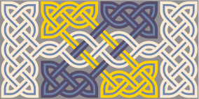

## The request

My friend Solus "Sol" Simkin has a well-earned reputation as a [Renaissance man](https://www.thefreedictionary.com/renaissance+man). Among other things, he is a virtuoso of design. He endows his creations with an ethereal air of perfection---where mathematics meets aesthetics---to transmogrify the mundane or banal into unforgettable works of art.

Some weeks ago, he was approached by---of all establishments---a firm of consulting philosophers, who wanted to brand their practice with a logo. They wanted something impressive, memorable, and easily recognized as pertaining to philosophy. They left the details to him, emphatically observing that they did not want their personal biases to colour their logo (pun intended) Image, icon, shield, or plain text: the choice of logo was his.

They want something impressive, memorable, and easily recognized as pertaining to philosophy. They have left it to you to decide whether it would be 

## The quest

This unusual request sent the cogwheels in Sol's brain whirring furiously as he imagined the logo from different design standpoints. He swept through, in fast motion in his mind, a myriad of options, only some of which I have chronicled here.

### Statues of Socrates and Diotima

He first thought of the statues of [Socrates](https://en.wikipedia.org/wiki/Socrates) and [Diotima](https://en.wikipedia.org/wiki/Diotima_of_Mantinea) whose words had earned his undying admiration when he had visited Athens just before the 2004 summer Olympics were held there. What noble thoughts from what ancient minds!

\begin{figure*}[h]
  \begin{minipage}[b]{0.5\linewidth}
    \centering
    \includegraphics[height=40mm]{images/socrates-close-up.jpg}
    \subcaption*{Socrates}
  \end{minipage}
  \begin{minipage}[b]{0.5\linewidth}
    \centering
    \includegraphics[height=40mm]{images/diotima-2.jpg}
    \subcaption*{Diotima}
  \end{minipage}
\end{figure*}

```{=html}
<div class="side-by-side">
<figure>

<figcaption>Socrates</figcaption>
</figure>
<figure>

<figcaption>Diotima</figcaption>
</figure>
</div>
```

But would a layperson recognize those statues and make the link? He thought not, in these days of frenetic and fading fashions and fads, which came and went faster than the famed fruitfly, [Drosophila melanogaster](https://en.wikipedia.org/wiki/Drosophila_melanogaster#Lifecycle_and_reproduction). Why, most people would not even recognize their national flags these days, let alone intellectual icons from the past.

### A syllogism in symbols?

Mathematics and philosophy are the two excursions of the human mind that naturally run closest to each other. Why not then a [syllogism](https://www.lexico.com/en/definition/syllogism) expressed in the austere symbols of mathematics?
$$
\begin{aligned}
a &\implies b\\
b &\implies c\\
\therefore\hspace{0.5em}a &\implies c
\end{aligned}
$$
He then pondered the legions of people who had made the compulsory bittersweet acquaintance with mathematics, forced upon them in elementary school, and forever forsworn thereafter. No, an expression of mathematical logic was not a good idea either: it would either evoke painful memories, or be passed over in utter incomprehension.

### Celtic symbols

Mathematics and philosophy share another quality. In one of its branches, mathematics is devoted to the study of [knots](https://en.wikipedia.org/wiki/Knot_theory) while [philosophy](https://www.britannica.com/topic/philosophy) generally grapples with the knotty problems of life. He thought about the [trefoil knot](https://mathworld.wolfram.com/TrefoilKnot.html), stylized as the Celtic [triquetra](https://en.wikipedia.org/wiki/Triquetra) and its relatives, with their logic-defying symmetry. Here was something symmetrical, beautiful, engaging, intriguing, mathematical, and philosophical, all at the same time. Surely, that would nail the design.

\begin{figure*}[h]
  \begin{minipage}[b]{0.5\linewidth}
    \centering
    \includesvg[height=40mm]{images/trefoil.svg}
    \subcaption*{Trefoil}
  \end{minipage}
  \begin{minipage}[b]{0.5\linewidth}
    \centering
    \includesvg[height=40mm]{images/braid.svg}
    \subcaption*{Braid}
  \end{minipage}
\end{figure*}

```{=html}
<div class="side-by-side">
<figure>

<figcaption>Trefoil</figcaption>
</figure>
<figure>

<figcaption>Braid</figcaption>
</figure>
</div>
```

But after he slept on the idea, it struck him as too vague: how would one know which [aspect of the braid](http://symboldictionary.net/?p=159) was being alluded to? What if someone thought of it as, say, the logo of a Society of [Druids](https://www.britannica.com/topic/Druid)? Too many ifs and buts obfuscated what had initially seemed an inspired  choice.

### Popper and falsifiability

Sol then turned his attention to science. [Karl Popper](https://en.wikipedia.org/wiki/Karl_Popper), who was one of the twentieth century's celebrated philosophers of science, came to mind. He had promulgated a principle that has its roots in mathematics.

It is not possible to _prove_ Pythagoras's Theorem simply by showing that it has held water in a million cases. But a _single counterexample_ disproving it would be sufficient to knock it off its perch on the pedestal of mathematical truth. Thankfully, that is not the case. The famed theorem has been proved by methods that are mathematically rigorous, and it will therefore stand the test of time. Period. No questions.

Unlike mathematics though, science is built up on the interplay between theory and experiments. There is no neat, logical way in which the "truth" of a theory may be proved. And again, a zillion experiments upholding the predictions of a theory do not necessarily prove its correctness. But the results of a _single_ experiment that contradicts the theory is enough to undermine it wholesale.

This asymmetry on the onus of proof in science is at the heart of the [Criterion of Falsifiability](https://www.britannica.com/topic/criterion-of-falsifiability) put forward by Popper.

Popper held that a scientific theory could never be pronounced correct even if it explained Nature countless times; but a single instance of its failure would suffice to prove its inadequacy. Popper's premise was that any theory that claimed the least pretence to be scientific must provide an experimentally [falsifiable prediction](https://en.wikipedia.org/wiki/Falsifiability) that could be settled conclusively by an experiment. 

But this foundational principle of science has now been called into question by [String Theory](https://www.britannica.com/science/string-theory), which is a relative newcomer to theoretical physics, but one that has captured the common imagination, judging by the popular explanations that abound on the Web [@mann2019; @wood2019; @jones2020]. And whether string theory is or is not science, Popper notwithstanding, is an issue that is still up for debate [@siegel2015; @castelvecchi2016; @alves2017; @francis2019].

But, coming back to the task at hand, how would such an abstract idea as falsifiability find expression in a logo? Perhaps the correct medium for it would be a [comic strip](https://www.explainxkcd.com/wiki/index.php/2078:_Popper), but alas, comics do not a logo make.

### Kuhn and paradigm shifts

Sol racked his brain for more ideas when he suddenly stumbled upon the half-remembered phrase [paradigm shift](https://www.lexico.com/definition/paradigm_shift) coined by Thomas Kuhn and popularized in his enduring tome, [_The Structure of Scientific Revolutions_](https://www.amazon.com/Structure-Scientific-Revolutions-50th-Anniversary/dp/0226458121/) [@kuhn2012]. Kuhn held that Science did not evolve smoothly, but every so often experienced seismic corrections or radical changes of perspective that led to new theories that predicted the world much better than before. But how in heaven was he to squeeze all that into a logo? And wouldn't that narrow it to the philosophy of science rather than to all of philosophy? Sol rued that he had entered another [cul-de-sac](https://www.merriam-webster.com/dictionary/cul-de-sac) in his reconnaissance for a viable design.

### The dream

It was now two weeks since he had been commissioned to work on the logo, and Sol did not have even a single draft design that passed muster. He feared that he was losing his famed golden touch that landed a winner with each project. Weary and teary after much squinting at screens and books, exhausted in body and mind, and a little apprehensive, he fell into a deep but refreshing sleep.

When he awoke, Sol had a clear recollection of a dream---or was it a reverie---in which he had met a man who had mouthed something that sounded foreign, but he was hard pressed to identify what pearls of wisdom had been uttered.

Thankfully, the man's face was etched in Sol's mind. And what a face! A head with a shock of dark hair that fell to his shoulders, a sharp nose, and a pair of piercing, knowing eyes that paradoxically had a dreamy look as well. His mouth was framed by a sparse moustache and a [Van Dyke beard](https://en.wikipedia.org/wiki/Van_Dyke_beard). It was a face vaguely familiar, yet tantalizingly out of recollection's reach.

Rather than fret and fume at not remembering the words in his dream, Sol decided to let the matter rest. He was on an earnest quest, conducted at his own pace, relaxed and without panic, but not so relaxed that the image faded from his mind's eye. 😊

### The search for a face

While he was working on an unrelated task, the thought suddenly flashed in his mind that he should harness the Web to see if there was any gallery of portraits of well-known philosophers against whom he could attempt a match with the face seen in his dream. It seemed like a hopeless task, but it was the sole lead he had.

A cursory search of the Web gave no comfort. The hair-style of the man in his dream definitely ruled out the [Wittgensteins](https://tinyurl.com/y2sn8uzb) and [Kierkegaards](https://tinyurl.com/y3xdx3gl).

He decided to search among the likes of [Leibniz](https://tinyurl.com/yxomtbt5) and [Newton](https://tinyurl.com/y5lc2fyx), both of whom were not only celebrated philosophers of their time, but also sported long locks, whether natural or wigged. But no luck there either. Their eyes appeared too different from those in his dream.

Since both Leibniz and Newton were renowned mathematicians as well, Sol got side-tracked thinking about whether calculus was discovered or invented [^1]. It was probably the greatest scientific advance of its time. And priority for its discovery was an ugly bone of contention between Leibniz and Newton [@bardi2007].

[^1]: Such meandering, away from the straight and narrow of his specified task, endowed his designs with a resplendent intellectual sheen, but took its toll on timeliness.

And then it hit him like a ton of bricks. _Calculus could not have been invented without coordinate geometry---that extraordinary offspring of the fortuitous marriage of geometry and algebra_. And the progenitor of _that_ wunderkind was [René Descartes](https://en.wikipedia.org/wiki/Ren%C3%A9_Descartes). With bated breath, Sol searched the Web for images of René Descartes. And bingo! he had a [gallery full of faces](https://tinyurl.com/y57nykjd) that were remarkably similar to the image of his reverie, with eyes that were piercing and dreamy at the same time.

## René Descartes

Relieved that he was at last on scent to the target, Sol relaxed for a couple of days, which he spent reading about the [life of Descartes](https://www.britannica.com/biography/Rene-Descartes) [@watson2020]. He chuckled when he read that "the 22-year-old [Queen] Christina [of Sweden] perversely made the 53-year-old Descartes rise before 5:00 am to give her philosophy lessons, even though she knew of his habit of lying in bed until 11 o’clock in the morning." [@watson2020]. He read with chagrin that Descartes tragically died in Sweden from pneumonia, presumably caused by the Scandinavian winter and the duress of having to rise early in the morning to keep his appointment with his royal pupil.

Sol foraged for anything that could throw light---like Newton's falling apple---on how Descartes got his primary insight of superimposing an orthogonal grid on the plane, to tame geometry with algebra. He could not unearth much and decided to pursue that query for when he did not have a deadline to meet. For now, he needed ideas for a logo, and time was fast racing past.

## The epiphany

Sol pondered the tragic death of Descartes, and whether _it_ held the clue to the deep philosophical truth that he was after. And then the elephant in the room popped into view. Why did Descartes, a Frenchman who lived for long in the Netherlands, die in Sweden? Because he had gone to teach _philosophy_ to Queen Christina; not mathematics but philosophy.

And what was Descartes' most profound philosophical utterance? Oh! Of course! [Cogito, ergo sum](https://en.wikipedia.org/wiki/Cogito,_ergo_sum): "I think, therefore I am". And there he had it: the muted words of his dream, and the nucleus of the logo he had been asked to design.

## From abstraction to form

The thrill of the quest was now over. It was time to sit down and flesh out an image from a dream. Sol was no stranger to ardour. He hunkered down and sifted through his options.

### Hand-crafting the logo

He could hand paint the logo electronically, giving it unique individuality. But Sol was no natural artist and looked askance at scrivening away on a tablet to artistic perfection.

Moreover, what would happen if his clients wanted to rejuvenate their logo after a few years. The transmogrification of the [3M Logo](https://1000logos.net/3m-logo/) in almost a century was a case in point. Its changes struck a fine balance between the old and the new---same enough to be recognizable from the past but new enough to attract and engage afresh. A hand-painted logo would be difficult to morph over time to retain its essence while renewing its expression. Logo-maintenance precluded a hand-drawn logo.

### Interactive graphics

Having settled for a formal font-based logo, Sol still had a choice of rendering it using software that allowed one to work on a canvas, just like a painter. Examples of freely available software like [Gimp](https://www.gimp.org/) and [Inkscape](https://inkscape.org/) came readily to mind.

Their primary advantage was their interactivity which gave almost instantaneous visual feedback of what was being drawn. And their basic features were easy to master and held the allure of quick and easy results.

The downside was that the results were not precisely repeatable because objects were edited and located by hand, even if their features were mathematically defined. One could manually tweak the control points on a [Bezier curve](https://pomax.github.io/bezierinfo/) until one's aesthetic sense was fully satisfied. But, being hand-drawn, they could not be repeated except through a `copy` function in the software.

### Programmatic generation

Generating digital graphics by programming was a slower, more tedious process that called for ample patience. Only those conversant with delayed gratification would opt for it. The feedback would neither be instantaneous nor visual. One needed to edit-compile-view, and re-edit, repeating this cycle until satisfied. Sol pondered the tedium that awaited him if he chose to go this way.

But the upside was the precision of a coded program. Numbers reigned. Small changes simply meant tweaking a digit here or there. Changing colours was a cinch. In keeping with the accomplishments of Descartes, it was the perfect marriage of art and science, of philosophy and mathematics.

### Making a choice

The dichotomy of choice between interactive and programmatic generation of graphics was easily resolved though. Sol only needed to think of giving his clients variants of a single thematic logo to choose from, or of the maintenance of the logo over time, through change of font, etc. It was clear that present pain bought future gain if he chose to program the logo.

Given that his logo would consist principally of words, Sol veered toward the [TeX-based](https://www.tug.org/levels.html) suite of typesetting tools. He finally settled upon the [LaTeX](https://www.latex-project.org/) format and the [XeTeX](http://xetex.sourceforge.net/) typesetting engine which gave him XeLaTeX. He decided that his output would be in [PDF](https://acrobat.adobe.com/in/en/acrobat/about-adobe-pdf.html) for paper and [SVG](https://en.wikipedia.org/wiki/Scalable_Vector_Graphics) for the Web, both of which afforded scalable graphics that would not degrade with resizing of the output medium, whether paper or screen. With these choices made, he rolled up his sleeves for a spot of work.

## The execution

With all the preliminaries in place, Sol settled down to work.

Meaning being conveyed.Colours do the talking.
Placement of the words. Stylizing. Colours. Emphasis. A few choices for his clients.


<!--LaTeX

boxes in LaTeX

boxsep
boxrule

Vpadding
Hpadding

Total:

Some arithmetic [Hugo Configuration](https://gohugo.io/getting-started/configuration/)

Examples

Generating PDFs, SVGs, images, banners, favicons-->

## Epilogue

The _SwanLotus_ banner you see on top of this page was generated using [open source](https://en.wikipedia.org/wiki/Open-source_software) tools that transformed text to PDF and thence to SVG. No specialized graphical applications or proprietary programs were involved in its making. If you are intrigued enough by this information and wish to try your hand at doing something similar, read on.

### Typesetting text professionally

Word processors have been around since the late seventies, but professional electronic typesetting took its birth in XXXX when a professor at Stanford University named Donald E Knuth developed and released top the world free-of-charge a program called TeX (pronounced XXX) that we intended to "typeset beautiful mathematics".

That program was not an easy one to master and it has spawned augmenteations called _formats_, the most well-known of which is the [LaTeX](https://www.latex-project.org/) document preparation system. LaTeX has traditionally been hemmed in by the types of fonts it could use, among other limitations. Its more recent relative---another format called XeLaTeX---overcomes this limitation. One result is the possibility of typesetting languages having a non-Latin script. Another advantage is that XeLaTeX allows for typesetting RL languages. Yet another benefit of XeLaTeX is the possibility of using its output to design logos, which is what we will discuss here.

### Why not a graphics program?

Why would one take the route of professional typesetting when there are so many free and not-so-free graphical programs that may be used to typeset a logo in a matter of minutes/ Why bother taking a tortuous route that involves writing in a markup language and debugging it until the desired result is achieved?

I will list my reasons for taking this route. Working with a graphics program usually involves placing and editing graphical objects interactively using a mouse. The final desired result may be frozen, but it cannot be changed easily. Depending on how significant the change is, considerable effort might be demanded. This is something I look upon askance because 

Change of colour, moving one object a smidgen, improving the kerning or any number of other changes---major or minor---may be programmatically made and repeatably too because what is involved is change of the "markup source code".

When edits are made by hand and the result tweaked by eye,what is obtained is optimal but not repeatable. If one were to change something, the result might not be as aesthetically pleasing. More about this later.

### The Illustrations

The statues of Socrates and Diotima shown in this blog are exhibited outside the [Undercroft](https://www.uwa.edu.au/theatres/venues/undercroft) of [The University of Western Australia](https://www.uwa.edu.au/).

