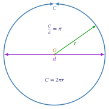
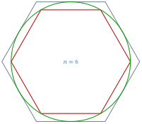
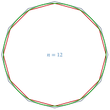
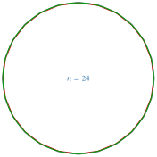
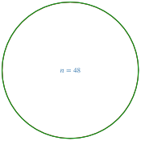
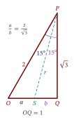

>This blog began life more than two decades ago, as part of a series of lectures I delivered to very bright first-year engineering students at an Australian university.
>
>The number $\pi$ (pronounced "pie") has been recognized from time immemorial because its physical significance can be grasped easily: it is the ratio of the circumference of a circle to its diameter. But who would have thought that such an innocent ratio would exercise such endless fascination because of the complexities it enfolds?
>
>Not surprisingly, some high students I met recently wanted to know more about $\pi$. Accordingly, I have substantially recast and refreshed my original presentation to better accord with the form and substance of a blog. The online references have also been updated to keep up with a rapidly changing Web.
>
>My original intention was to write a single blog on $\pi$. But because I did not want it to become yet another overly long _slog_, I have decided to divide the material into two parts.
>
>If there are any errors or omissions, please [email](mailto:feedback.swanlotus@gmail.com) me your feedback.

## Circumference, diameter, and π

The straight line or [geodesic](https://mathworld.wolfram.com/Geodesic.html) is the shortest distance between any two points on a plane, sphere, or other space. The circle is the [locus](https://en.wikipedia.org/wiki/Locus_(mathematics)) traversed by a moving point that is [equidistant](https://en.wikipedia.org/wiki/Equidistant) from another fixed point on a two-dimensional plane. It is the most [symmetrical](https://mathworld.wolfram.com/Symmetry.html) figure on the plane. The [diameter](https://en.wikipedia.org/wiki/Diameter) is the name given both to any straight line passing through the centre of the circle---intersecting it at two points---as well as to its length. When we divide the [perimeter](https://en.wikipedia.org/wiki/Perimeter) of a circle, more properly called its [circumference](https://en.wikipedia.org/wiki/Circumference), $C$, by its diameter, $d$, we get the enigmatic constant  $\pi$, which has a value between $3.141$ and $3.142$: 
$$
\frac{C}{d} = \pi.
$${#eq:pi-Cd}
The diameter $d$ is twice the radius $r$, and substituting for $d$ into [@eq:pi-Cd], we get the well-known school formula:
$$
C = \pi d = 2\pi r \approx 2\left[\frac{22}{7}\right]r \approx 6.28r.
$${#eq:two-pi-r}
Note, however, that $\pi$ is _not exactly equal_ to $\frac{22}{7}$. This value is a convenient _rational fraction approximation_ for $\pi$ that serves well in elementary contexts.^[See ["A tale of two measures: degrees and radians"](https://swanlotus.netlify.app/blogs/a-tale-of-two-measures-degrees-and-radians).]

You might reasonably wonder whether the ratio of the circumference to the diameter of _any_ circle is _always_ $\pi$. The answer is "Yes", because _all circles are similar_. The ratios of corresponding lengths of similar figures are equal. This idea is also covered in my blog ["A tale of two measures: degrees and radians"](https://swanlotus.netlify.app/blogs/a-tale-of-two-measures-degrees-and-radians).

The symbol [$\pi$](https://en.wikipedia.org/wiki/Pi) is the lowercase version of the sixteenth letter of the Greek alphabet. For the history of its use in mathematics, see [adoption of the symbol π in Wikipedia](https://en.wikipedia.org/wiki/Pi#Adoption_of_the_symbol_%CF%80).

{#fig:pi-circle width=70% .modal-target}

[@fig:pi-circle] shows the relationships in [@eq:pi-Cd; @eq:two-pi-r] pictorially. The circumference of a circle is about 6.28 times its radius. Why this should be so is a secret of Nature, a mystery of the space we inhabit.

A wonderfully revealing story lies behind this mysterious relationship, and it is due to the [labours](https://www.collinsdictionary.com/dictionary/english/labours) of one man, in the days when calculators could not be dreamed of, and when neither the decimal system of numbers, nor trigonometry were known. That is the story we look at next.

## Archimedes of Syracuse

[Archimedes of Syracuse](https://en.wikipedia.org/wiki/Archimedes)^[His very name, Archimedes, means "master thinker" in Greek.] (Ἀρχιμήδης, 287--212 BCE) was a [polymath](https://www.vocabulary.com/dictionary/polymath#:~:text=Definitions%20of%20polymath,of%20great%20and%20varied%20learning) and genius of the ancient world. He was one of the greatest mathematicians the world has ever known. By today's standards, he would be called a mathematician, physicist, engineer, and astronomer, [all rolled into one](https://www.ldoceonline.com/dictionary/all-rolled-into-one). He is perhaps most famous for running out of his bathtub naked exclaiming ["Eureka"](https://www.dictionary.com/browse/eureka)---Greek for "I have found it"---oblivious of those around him. The principle that he had then discovered---that the upthrust on a body submerged in a fluid is equal to the weight of fluid displaced---is known as [Archimedes' Principle](https://www.britannica.com/science/Archimedes-principle).

![Archimedes of Syracuse.^[Domenico Fetti's 1620 painting entitled _Archimedes Thoughtful_. Public domain.]](images/Domenico-Fetti_Archimedes_1620.jpg){#fig:archimedes width=50% .modal-target}

Among the many accomplishments of Archimedes is his method for estimating $\pi$, which was the best approximation for almost 1900 years. And it was not based on using a length of string, superimposing it on a circle, and getting an estimate! \emojifont :wink:\normalfont 

What is even more remarkable is that Archimedes made his discovery _without_ the benefit of:

(a) the real numbers;

(b) algebra; 

(c) trigonometry;

(d) decimal notation; and

(e) devices like logarithm tables, slide rules, calculators, or computers. 

Instead he applied geometry---including the theorem of Pythagoras---and extracted rational values for square roots, laboriously by hand. His method is also an excellent geometrical illustration of the idea of a [_limit_](https://www.britannica.com/science/limit-mathematics), with which he was doubtless familiar. It is known that Archimedes was familiar with what we now know as integral calculus, and it is possible that he may have anticipated differential calculus as well.

Archimedes devised an ingenious method for estimating the circumference of a circle. He used a simple yet sophisticated algorithm that allowed him to obtain successively more accurate values for the circumference of a circle, and therefore of $\pi$.

. All portraits of Archimedes are flights of fancy rather than true likenesses.](images/Archimedes-AI-generated-portrait.png){#fig:Archimedes-AI width=70% .modal-target}

## Principles used by Archimedes

The method that Archimedes devised is instructive because it is a synthesis of several principles by which the greatest human minds have furthered scientific progress over time. The abstract principles that Archimedes used to estimate $\pi$ were these:

#. Start with the known and progress to the unknown;

#. Initialize variables;

#. Devise a method of increasing the accuracy of the estimate by [recursion](https://mathworld.wolfram.com/Recursion.html) or [iteration](https://www.vocabulary.com/dictionary/iteration);

#. Stop when the desired accuracy is reached.

These principles constitute what is known as an [algorithm](https://www.merriam-webster.com/dictionary/algorithm). Once such a systematic framework has been put in place, it can be applied in many research domains to aid rapid scientific progress. The algorithm is the basis of modern computing.

## Of polygons and circles

Archimedes considered a circle, containing an [inscribed](https://mathworld.wolfram.com/Inscribed.html) regular polygon with $n$ sides, and [circumscribed](https://mathworld.wolfram.com/Circumscribed.html) by a regular polygon with the same $n$ sides. [@fig:two-limits] illustrates this for the case $n = 6$, i.e., with a regular [hexagon](https://www.britannica.com/science/hexagon).

.](images/two-limits.svg){#fig:two-limits width=70% .modal-target}

{#fig:sin-theta-tan-theta width=70% .modal-target}

Let us tabulate below the variables arising from [@fig:two-limits;@fig:sin-theta-tan-theta].

| Parameter | Circle | Inscribed | Circumscribed |
|:-------|:----------|:-------------------------|:-----------------|
| Radius | $r$ |  |  |
| Sides |  | $n$ | $n$ |
|Length |  | $2r\sin\theta$ | $2r\tan\theta$ | 
| Angle |  | $\theta(n) = \frac{\pi}{n} = \frac{180°}{n}$ | $\theta(n) = \frac{\pi}{n}=\frac{180°}{n}$ |
| Apothem |  | $h = r\cos\theta$ |  $h = r$ |
| Area | $A = \pi r^2$ | $a(n) = n\sin\theta\cos\theta r^2$ | $A(n) = n\tan\theta r^2$ |
| Perimeter | $C = 2\pi r$ | $c(n) = 2n\sin\theta r$ | $C(n) = 2n\tan\theta r$ |
: Circle, inscribed, and circumscribed regular polygons ($n$-gons). {#tbl:variables}

\ 

When $n$ varies, so do the values of $\theta$ and the areas and perimeters; they are therefore shown as functions of $n$ in [@tbl:variables].

## Recursion and Iteration

Archimedes started with regular hexagons and successively _doubled_ the number of sides, until he had the circle closely sandwiched between two 96-gons---one circumscribed; the other inscribed. Successively doubling or halving is a fast-converging technique used in numerical estimation, called the [bisection method](https://en.wikipedia.org/wiki/Bisection_method), that is applied to solving a variety of problems. That Archimedes was aware of it shows how far ahead of his time his thinking was.

When he moved from $n=6$ to $n = 12$ sides, how did Archimedes estimate the respective perimeters without the aid of trigonometry? He used geometry and the Pythagorean theorem, [as described online here](https://nonagon.org/ExLibris/archimedes-pi) [@bertrand2014] [and here](https://publications.azimpremjiuniversity.edu.in/3356/1/02-DaminiAndAbhishek_PiIs22By7_Final.pdf) [@damini-dhar-2020] to obtain [recurrence relations](https://en.wikipedia.org/wiki/Recurrence_relation) that gave the current estimate from the previous one.

For an English translation of the book _Measurement of a Circle_ by Archimedes [click on this link](auxiliary/Archimedes-Circle.pdf). It is the original source material from the man himself, and will give you a sense of completeness in your understanding of his method.

He repeatedly calculated _rational approximations_ to $\pi$ until he was satisfied with the accuracy. The principle of the method is clearly seen in [@fig:six-gon;@fig:twelve-gon;@fig:twenty-four-gon;@fig:forty-eight-gon;@fig:ninety-six-gon].

{#fig:six-gon width=70% .modal-target}

{#fig:twelve-gon width=70% .modal-target}

{#fig:twenty-four-gon width=70% .modal-target}

{#fig:forty-eight-gon width=70% .modal-target}

{#fig:ninety-six-gon width=70% .modal-target}

## Lower and upper bounds for π

We assume that $r = 1$ without loss of generality. [@tbl:variables] and [@fig:sin-theta-tan-theta] together give us these inequalities for regular $n$-gons where $\theta = \frac{180}{n}$ degrees or $\theta = \frac{\pi}{n}$ radians.^[Recall that the area of a triangle is half the product of its base and perpendicular height]
$$
\begin{aligned}
a(n) < A < A(n) &\implies n\sin\theta\cos\theta < \pi < n\tan\theta\\
c(n) < C < C(n) &\implies n\sin\theta < \pi < n\tan\theta\\
\end{aligned}
$${#eq:squeeze}

From the right hand side of [@eq:squeeze], using the inequalities for perimeters, we have
$$
n\sin\tfrac{180°}{n} = n\sin\tfrac{\pi}{n}, \thinspace \mbox{for the lower bound}.
$$ {#eq:lower-bound}
and
$$
n\tan\tfrac{180°}{n} = n\tan\tfrac{\pi}{n}, \thinspace \mbox{for the lower bound}.
$$ {#eq:upper-bound}

[@eq:lower-bound; @eq:upper-bound] represent respectively the lower and upper bounds on the value of $\pi$ obtained through the method of Archimedes.

Obviously, the circle may be viewed as a regular polygon whose number of sides, $n$ has become exceedingly large, or _infinite_. So, as $n$ is increased, we should expect the two bounds to converge to the limiting value of $\pi$.

| $n$ | $n\sin\frac{\pi}{n}$ | $n\tan\frac{\pi}{n}$ |
|------:|-------------:|-------------:|
| $6$ | $3.0000000000$ | $3.4641016151$ |
| $12$ | $3.1058285412$ | $3.2153903092$ |
| $24$ | $3.1326286133$ | $3.1596599421$ |
| $48$ | $3.1393502030$ | $3.1460862151$ |
| $96$ | $3.1410319509$ | $3.1427145996$ |
| $100$ | $3.1410759078$ | $3.1426266043$ |
| $1000$ | $3.1415874859$ | $3.1416029891$ |
| $10000$ | $3.1415926019$ | $3.1415927569$ |
| $100000$ | $3.1415926531$ | $3.1415926546$ |
| $1000000$ | $3.1415926536$ | $3.1415926536$ |
: The values of $n\sin\frac{\pi}{n}$ and $n\tan\frac{\pi}{n}$. As $n$ increases without bound, the values in the second and third columns both approach the true value of $\pi$ with increasing accuracy. {#tbl:large-n-pi}

\ 

The upper and lower bounds are equal up to ten decimal digits when $n = 10^{6}$, and we might as well declare the problem of estimating $\pi$ solved. But in the time of Archimedes, trigonometry was not known; only geometry was. Moreover, the decimal system and calculators were also in the future.

To improve our visualization of what is happening, the values of $n$ and $c(n)$ may be plotted as points of a discrete valued function on $x-y$ coordinate axes. In addition, if we relax conditions, and move from integer to real values---i.e., from $n$ to $x$---we may plot the curve of $x\sin\frac{180°}{x}$ against $x$ to get a feel for the large value behaviour of the curve. This is shown in [@fig:plot]:

{#fig:plot width=90% .modal-target}

 We now have to backtrack and attempt to retrace the steps Archimedes used to estimate $\pi$, without trigonometry, to better appreciate his heroic efforts.

## Recapitulation

Evaluating the bounds given in [@tbl:variables] and [@eq:squeeze] by setting $r = 1$, $n = 6$, and $\theta = \frac{180}{n} = 30°$^[Rather than use radians with $\pi$ entering the proceedings, I decided to stick with degrees as units to avoid confusion. If one uses power series to probe further, of course, radians are called for.] gives us these values, as extracted from [@tbl:large-n-pi]:
$$
\begin{aligned}
C_i &= 2n\sin\theta r = 12(\sin 30°) = 12(0.5) &= 6.0000.\\
C &= 2\pi r &= 6.2381.\\
C_c &= 2n\tan\theta r = 12(\tan 30°) = 12\left(\tfrac{\sqrt{3}}{3}\right) = 4\sqrt{3} &\approx 6.9282.\\
\end{aligned}
$${#eq:triple-6}

Archimedes doubled $n$ four times to compute values for regular polygons with $12$, $24$, $48$, and $96$ sides. For his last calculation with $n = 96$ and $\theta = \tfrac{180}{96}° \approx 1.875°$, we have:
$$
\begin{aligned}
C_i &= 2n\sin\theta r = 2(96)\sin{1.875°} \approx 192(0.0327) &\approx 6.2820.\\
C &= 2\pi r &= 6.2381.\\
C_c &= 2n\tan\theta r = 2(96)\tan{1.875°} \approx 192(0.0327) &\approx 6.2854.\\
\end{aligned}
$${#eq:triple-96}

Note that in the case of 96 sides, we have a _very small angle_ $\theta$ whose $\sin$ and $\tan$ are almost equal. This is what gives us tight bounds on the estimate of $\pi$. If you know [the power series for $\sin\theta$ and $\tan\theta$](https://math.libretexts.org/Bookshelves/Differential_Equations/A_First_Course_in_Differential_Equations_for_Scientists_and_Engineers_(Herman)/08:_Appendix_Calculus_Review/8.07:_Power_Series), you will appreciate even better how the value of $\pi$ is trapped and squeezed between these two rather close limits.

Remember [@eq:triple-96] because it helps us to estimate lower and upper bounds for the value of the circumference. Archimedes's application of the [squeeze theorem](https://en.wikipedia.org/wiki/Squeeze_theorem) nineteen centuries before the calculus was invented is illustrated in the series of [@fig:six-gon;@fig:twelve-gon;@fig:twenty-four-gon;@fig:forty-eight-gon;@fig:ninety-six-gon].

If you study the calculus or analysis later on, and encounter the [epsilon-delta ($\epsilon-\delta$) definition of a limit](https://en.wikipedia.org/wiki/Limit_of_a_function) hark back to this example of Archimedes for a graphic an concrete example of how a value may be bounded from below and above and how it may be [squeezed](https://demonstrations.wolfram.com/SqueezeTheorem/) into the limit.

[Sanity check](https://en.wiktionary.org/wiki/sanity_check): Does $2\pi = 6.2820$, from a calculator, lie within the bounds of [@eq:triple-96]? Yes, indeed, and we are [home and dry](https://dictionary.cambridge.org/dictionary/english/be-home-and-dry).

Second sanity check: When $n$ is very large, we expect $n\sin\frac{180°}{n}$ to be closer and closer to the true value. Setting $n = 10^6$ and evaluating on a calculator we get $10^6\sin\frac{180°}{10^6} = 3.14159$ which is reassuring. This deep connection between the circle and the trigonometric functions also explains why they are sometimes called the _circular functions_. Indeed, the values $n\sin\frac{\pi}{n}$ and $n\sin\tan{\pi}{n}$ both converge to $\pi$ for very large $n$. The interested reader should plot these two curves.

### The thirty, sixty, ninety right triangle

Archimedes applied the principle "of starting from the known" to initiate his algorithm using a _regular hexagon_, which is a mosaic of six juxtaposed equilateral triangles. We know from symmetry that each angle of an equilateral triangle is $60°$. When an equilateral triangle is bisected, we get two right-angled triangles with angles of thirty and sixty degrees, as shown in [@fig:thirty-sixty].

{#fig:thirty-sixty width=80% .modal-target}

The inscribed hexagon, within a circle of _radius_ one unit, also has a side of one unit. Thus, the hypotenuse of the circle $OAP$ in [@fig:thirty-sixty] has a length of 2 units. Moreover, the base $OP$, resulting from a bisected side, has a length of one a unit. By applying the theorem of Pythagoras, the third side, $AP$ is 
$$
\sqrt{2^2 - 1^2} = \sqrt{3}.
$${#eq:triangle}

The next thing Archimedes needed---and knew how to do---was to compute $\sqrt{3}$, which figures in [@eq:triangle]. Finding square roots is a tedious process, not unlike long division, and prone to human error. The patience and doggedness of Archimedes that must have gone into the process is astounding.

### Extracting square roots by hand

Archimedes must have known how to extract square roots by hand. Perhaps, he used one of the methods described in my blog ["How Are Numbers Built?"](https://swanlotus.netlify.app/blogs/how-are-numbers-built). He should have known the value of $\sqrt{3}$ as a rational fraction.  With remarkable accuracy, he stated that:
$$\sqrt{3} \approx \frac{265}{153} \approx 1.732.
$${#eq:sqrt3}

## Trigonometry and half angles

Archimedes had no trigonometric tables to aid him. But he did know the square root of three, and the geometric properties of triangles whose angles were repeatedly bisected. He used a previous result to feed values into the next result as he doubled the sides of the regular hexagon. We will look at his method a little later, but for now, we will try to simulate what he did using trigonometry. In the process we will encounter an important idea called [recursion]((https://www.geeksforgeeks.org/introduction-to-recursion-2/)), which is a bit like a snake eating its own tail.

From [@fig:thirty-sixty], we know:
$$
\begin{aligned}
\sin 30° &= \tfrac{1}{2}\\
\cos 30° &= \tfrac{\sqrt{3}}{2}\\
\tan 30° &= \tfrac{1}{\sqrt{3}} = \tfrac{\sqrt{3}}{3}\\
\end{aligned}
$$ {#eq:three-six-nine}

## The half-angle formulae and recursion

The whole trick to this recursion is to 

#. move from one estimate to the next, more accurate estimate of $\pi$; and

#. use one known value of a trigonometric function to estimate the next unknown value in the chain, _without_ resorting to tables of values, or calculators.

The trigonometry of [half angles in terms of the full angle]( https://math.libretexts.org/Bookshelves/Algebra/Algebra_and_Trigonometry_1e_(OpenStax)/09:_Trigonometric_Identities_and_Equations/9.03:_Double-Angle_Half-Angle_and_Reduction_Formulas) [@half-angle] helps relate the successive values of $\theta$:^[All angles are in the first quadrant.]
$$
\begin{aligned}
\sin\frac{\theta}{2} = \sqrt{\frac{1 - \cos\theta}{2}}\\
\cos\frac{\theta}{2} = \sqrt{\frac{1 + \cos\theta}{2}}\\
\end{aligned}
$$

Let us step through the recursion:

#. We know from [@fig:thirty-sixty] and [@eq:three-six-nine] that $\sin 30° = \frac{1}{2}$ and $\cos 30° = \frac{\sqrt{3}}{2}$.

#. We calculate $\sin 15°$ etc., from $\cos 30°$ using the half-angle formula:
$$
\begin{aligned}
\sin 15° &= \sqrt{\frac{1 - \frac{\sqrt{3}}{2}}{2}}\\
&= \sqrt{\frac{2 - \sqrt{3}}{4}}\\
&= \frac{1}{2}\sqrt{2 - \sqrt{3}}\\
\cos 15° &= \sqrt{\frac{1 + \frac{\sqrt{3}}{2}}{2}}\\
&= \sqrt{\frac{2 + \sqrt{3}}{4}}\\
&= \frac{1}{2}\sqrt{2 + \sqrt{3}}\\
\tan 15° &= \frac{\sqrt{2 - \sqrt{3}}}{\sqrt{2 + \sqrt{3}}}\\
\end{aligned}
$$
For comparison with another method we will use later on---in [The angle bisector theorem]---the value of $\sin 15°$ we get from the equation above is 0.2588190451025208.

#.  Using the value of $\cos 15°$, we get, for $7.5°$
$$
\begin{aligned}
\sin 7.5° &= \sqrt{\frac{1 - \frac{1}{2}\sqrt{2 + \sqrt{3}}}{2}}\\
&= \frac{1}{2}\sqrt{2 - \sqrt{2 + \sqrt{3}}}\\
\cos 7.5° &= \sqrt{\frac{1 + \frac{1}{2}\sqrt{2 + \sqrt{3}}}{2}}\\
&= \frac{1}{2}\sqrt{2 + \sqrt{2 + \sqrt{3}}}\\ 
\end{aligned}
$$

#. Using the value of $\cos 7.5°$, for $3.75°$ we get:
$$
\begin{aligned}
\sin 3.75° &= \sqrt{\frac{1 - \frac{1}{2}\sqrt{2 + \sqrt{2 + \sqrt{3}}}}{2}}\\
&= \frac{1}{2}\sqrt{2 - \sqrt{2 + \sqrt{2 + \sqrt{3}}}}\\
\cos 3.75° &= \frac{1}{2}\sqrt{2 + \sqrt{2 + \sqrt{2 + \sqrt{3}}}}\\
\end{aligned}
$$

#. We can see a pattern emerge and we _guess_ that the values for $\theta = 1.875°$ corresponding to $n=96$ _should_ be:
$$
\begin{aligned}
\sin 1.875° &= \frac{1}{2}\sqrt{2 - \sqrt{2 + \sqrt{2 + \sqrt{2 + \sqrt{3}}}}}\\
\cos 1.875° &= \frac{1}{2}\sqrt{2 + \sqrt{2 + \sqrt{2 + \sqrt{2 + \sqrt{3}}}}}\\
\end{aligned}
$$
Because we guessed, we checked the value we obtained above---expressed as a decimal---with a calculator, and it checked out.

We went through this somewhat painful process for the reasons outlined below because we wanted to simulate the steps Archimedes took [@damini-dhar-2020; @bertrand2014]. It is a proof of concept---where we have only evaluated the sine and cosine values, and not estimated the two perimeters. The following points bear noting:

(a) Archimedes knew the sine of 30° and had to work out all other values by hand, without using decimals. That was why we started with a regular hexagon, and retained [surds](https://www.thefreedictionary.com/surds), along with their awkward algebraic manipulation.

(a) Archimedes only knew [rational numbers](https://www.britannica.com/science/rational-number) of the form $\frac{a}{b}$ where $a$ and $b$ are integers and $b \neq 0$. So, his approximations for $\sqrt{2}$ and $\sqrt{3}$ were expressed as improper fractions that approximated those numbers.

(a) Archimedes did not have positional notation for his calculations and he had to rely on an arithmetical system that we would find forbidding.

(a) We have demonstrated how Archimedes used recursion in his estimate of $\pi$. In recursion, we usually _stop_ at the _base case_. In our example, we have _started_ with the regular hexagon, which is the base case. And we have stopped computing once $n$ reached $96$.

(a) We cheated when we used trigonometric half-angle formulae. Archimedes did not have them, but he  used right-angled triangles in a semi-circle and leveraged his knowledge of similar triangles and Pythagoras' theorem. We use a slightly different approach, considered next, to get the results he did, without using trigonometry.

### The angle bisector theorem

Without using the half-angle formulae of trigonometry, how can we successively obtain expressions for the values of $c(n)$ and $C(n)$ as we halve the angles and double the sides each time? We have to rely on something called the [angle bisector theorem](https://en.wikipedia.org/wiki/Angle_bisector_theorem) from geometry.

This derivation might seem tedious, but it is closer to what Archimedes did in order to establish the recurrence relation that tied the current value to the previous value.

{#fig:angle-bisector width=70% .modal-target}

Referring to [@fig:angle-bisector], if the line $OC$ bisects the angle $BOA$, then the base $AB$ is divided in the same ratio as the corresponding sides. This means
$$
\begin{aligned}
\frac{AO}{OB} &= \frac{AC}{CB} \mbox{ which in turn means that }\\
\frac{a}{b} &= \frac{p}{q}\\
\end{aligned}
$$ {#eq:angle-bisector}

Applying the theorem to a thirty-sixty-ninety right-angled triangle, we get [@fig:bisect-thirty] shown below.

{#fig:bisect-thirty width=45% .modal-target}

Since $OQ$ is one unit,
$$
a+b = 1.
$$ {#eq:bisect1}
Also,
$$
\begin{aligned}
\frac{a}{b} &= \frac{2}{\sqrt{3}}\\
a &= \frac{2}{\sqrt{3}}b\\
&= \frac{2\sqrt{3}}{3}b\\
\end{aligned}
$$ {#eq:bisect2}
Substituting for $a$ from [@eq:bisect2] into [@eq:bisect1] gives us
$$
\begin{aligned}
\frac{2\sqrt{3}}{3}b + b &= 1\\ 
\left[\frac{2\sqrt{3}}{3} + 1\right] b &= 1\\
\left[\frac{2\sqrt{3} + 3}{3}\right] b &= 1\\
b &= 2\sqrt{3} - 3\\
\end{aligned}
$$ {#eq:bisect3}

Pythagoras' theorem, applied to right triangle $PQS$, gives us
$$
\begin{aligned}
PS^2 &= SQ^2 + QP^2\\
r^2 &= b^2 + \sqrt{3}^2\\
&= b^2 +3 \implies r = \sqrt{b^2 + 3}\\
\end{aligned}
$$ {#eq:bisect4}
Now,
$$
\begin{aligned}
b^2 + 3 &= \left[{2\sqrt{3} - 3}\right]^2 + 3\\
&= {12 - 12\sqrt{3} + 9 + 3} \\
&= 12(2 - \sqrt{3})
\end{aligned}
$$ {#eq:bisect5}
Therefore, 
$$
\begin{aligned}
r &= \sqrt{b^2 + 3}\\
&= \sqrt{12(2 - \sqrt{3})}\\
&=2\sqrt{6 - 3\sqrt{3}}\\
\end{aligned}
$$ {#eq:bisect6}

Putting together [@eq:bisect3; @eq:bisect5], we get
$$
\begin{aligned}
\sin 15° &= \frac{b}{r}\\
&= \frac{1}{2}\left[\frac{2\sqrt{3} - 3}{\sqrt{6 - 3\sqrt{3}}}\right]\\[1em]
&\approx 0.2588190451025207\\
\end{aligned}
$$
And we are done! I do not intend to pursue this tedious process any more. I have pressed on thus far only because I wanted to convey to you an appreciation of the travails that Archimedes must have undergone without any of the modern mathematical conveniences we enjoy, like calculators and computers. _Gauging by the heroic effort he put in to estimate $\pi$, Archimedes must have loved mathematics very dearly_.

The fact that we have obtained the same value of $\sin 15°$ by using two different approaches---[one using trigonometry][the half-angle formulae and recursion], and the other using pure geometry--- illustrates the richness that lies ahead, waiting to be explored by some intrepid student of mathematics.

### Digression: Denesting Surds

But wait a minute. How do we simplify expressions containing square roots within square roots? Such expressions are called [nested surds](https://undergroundmathematics.org/thinking-about-algebra/nested-surds/solution). Is there an easy way to confirm---without using calculators---that the two results we got are indeed the same number? How do we unpack surds within surds? Because calculators have finite precision, how do we know that the two exact expressions involving surds, on either side of the equality sign below, are indeed equal?
$$
\begin{aligned}
\frac{1}{2}\sqrt{2 - \sqrt{3}} &= \frac{1}{2}\left[\frac{2\sqrt{3} - 3}{\sqrt{6 - 3\sqrt{3}}}\right]\mbox{ or more simply that}\\
\sqrt{2 - \sqrt{3}}&= \left[\frac{2\sqrt{3} - 3}{\sqrt{6 - 3\sqrt{3}}}\right]\\
\end{aligned}
$$

Fortunately, there are many resources on the Web, from book chapters, to dedicated web pages, to video presentations, that deal with this interesting, but seldom discussed topic---_denesting surds_  [@ds-underground; @ds-brown; @ds-jeffrey-rich; @ds-yt-method]. Choose any one, or even all, references to learn from, and then tackle the above problem.

For starters, I will outline how to denest $\sqrt{6-3\sqrt{3}}$. Let $\sqrt{6-3\sqrt{3}} = \sqrt{a} - \sqrt{b}$ where $0 \leq b \leq a$. We square both sides and obtain expressions for $a + b$ and $ab$. This will result in a quadratic equation with two solutions. We choose the larger value for $a$. The two solutions in this case are $a = \frac{9}{2}$ and $b = \frac{3}{2}$ leading to 
$$
\sqrt{6-3\sqrt{3}} = \frac{3 - \sqrt{3}}{\sqrt{2}} = \frac{3\sqrt{2} - \sqrt{6}}{2}.
$$
Note that there are no nested square roots on the right hand side (RHS). The salient point is that, since we are dealing with surds, we should get identical, closed form, exact expressions for both $\sqrt{2 - \sqrt{3}}$ and $\left[\frac{2\sqrt{3} - 3}{\sqrt{6 - 3\sqrt{3}}}\right]$ _without using decimals_. And that takes some effort, using paper and pencil, or software like [Geogebra](https://www.geogebra.org/).

&&&&&&&&&&&&&&&&&&&&&&&&&&&&&&&&
PLOT of n sin x/n as n becomes very large: asymptotes to pi?
&&&&&&&&&&&&&&&&&&&&&&&&&&&&&&&&

## Sanity checks

## Graph of n sin pi/n as n becomes extremely large

WHERE SHOULD THIS GO?

Imagine the mathematical [fortitude](https://www.merriam-webster.com/word-of-the-day/fortitude-2019-11-21) of Archimedes to [plough on](https://www.collinsdictionary.com/dictionary/english/plough-on)---without algebra or trigonometry or the decimal number system---to establish the value of $\pi$.

Before we consider numerical results, there are two aspects of the problem and the approach taken by Archimedes that I wish to discuss.

#

## Is π really 22/7?

Is $\pi$ really equal to $\frac{22}{7}$, as it has been drummed into our heads at school? We will answer that question later in this blog.

The answer is a qualified "Yes and no". Because $\pi$ is irrational, it cannot be expressed precisely in a finite number of digits. Consequently, we use rational approximations, or a decimal representation at the desired accuracy for $\pi$. Thanks to Archimedes, $\frac{22}{7}$ is a serviceable overestimate for $\pi$ that has survived for centuries.

## A closer look at π as a number

Pi is both an [irrational](https://en.wikipedia.org/wiki/Irrational_number) and a [transcendental](https://en.wikipedia.org/wiki/Transcendental_number) number. Let us see what each of these [appelations](https://www.merriam-webster.com/dictionary/appellation) mean.

Recurring decimals.

## To explore further

A well-written, accessible article on how Archimedes estimated that $\pi$ is approximately $\frac{22}{7}$ is available online: ["How Archimedes showed that pi is approximately 22 by 7"](https://publications.azimpremjiuniversity.edu.in/3356/1/02-DaminiAndAbhishek_PiIs22By7_Final.pdf). I urge you to read it.^[This article is all the more remarkable because its first author is a Grade 8 student: proof that deep mathematics is not beyond the school student.] You will then appreciate for yourselves how arduous the process must have been in an age without the benefit of:
#. Trigonometry; he used the theorem of pythagors instead;
#. Algebra; he used geometry and the ratios of the lengths of well-known triangles;
#. Decimal numbers for division; he used fractions instead;
square roots by hand; similar and congruent figures; bisection theorems; exhaustion methods

In [@fig:six-gon;@fig:twelve-gon;@fig:twenty-four-gon;@fig:forty-eight-gon;@fig:ninety-six-gon] below, which illustrate the approach Archimedes took to estimate $\pi$, we see very clearly that the perimeter of the _inscribed polygon_ $c_n$ and the perimeter of the _circumscribed polygon_ $C_n$ represent respectively the _lower bound_ and _upper bound_ of the estimated value of $\pi$. As the number of sides, $n$, of the polygon increases, the estimates become increasingly accurate.

https://publications.azimpremjiuniversity.edu.in/3356/1/02-DaminiAndAbhishek_PiIs22By7_Final.pdf

https://azimpremjiuniversity.edu.in/at-right-angles

### How did Archimedes arrive at π = 22/7?

22/7 = 3.142857 142857 142857 (recurring decimal)

## Formulae involving π

## Quest for the endless digits of π

## Buffon's Needle

## π Trivia

## Web links

https://www.pbs.org/wgbh/nova/physics/approximating-pi.html

https://demonstrations.wolfram.com/ArchimedesApproximationOfPi/
John Tucker "Archimedes' Approximation of Pi"
http://demonstrations.wolfram.com/ArchimedesApproximationOfPi/
Wolfram Demonstrations Project
Published: March 5 2009

https://math.stackexchange.com/questions/4851929/archimedes-method-to-estimate-pi

http://arxiv.org/pdf/2008.07995

https://mathsciencehistory.com/2019/10/01/archimedes-and-his-pi-the-great-numerical-hope/

https://carmamaths.org/resources/jon/pi-culture.pdf

https://nonagon.org/ExLibris/archimedes-pi

https://www.exploratorium.edu/pi/history-of-pi

https://en.wikipedia.org/wiki/Approximations_of_%CF%80

https://www.joyofpi.com/

https://math.stackexchange.com/questions/2758418/deriving-the-power-series-for-cosine-using-basic-geometry

https://www.youtube.com/watch?v=K5W0DMMukZQ

## Book References

## Web resources

## Teaser: are of circle half radius multiplied by circumference. How?

## Appendix: Circumscribed and inscribed polygons of  circle

Archimedes devised his ingenious _squeeze_ method for computing the upper and lower bounds of the perimeter of a circle by computing instead the perimeters of the polygons that inscribe and circumscribe the circle. The approximations become more accurate as the number of sides, $n$, of the polygon is increased. [This YouTube presentation](https://www.youtube.com/watch?v=_qdnyw5Eb_Y) might help you understand the algorithm of Archimedes better, but remember that he did not have trigonometry to aid him.

## Acknowledgements

Some computations for this blog were performed using programs written by [Nandakumar Chandrasekhar]() in the [Julia programming Language](https://julialang.org/). The source code is available here:

## Feedback

Please [email me](mailto:feedback.swanlotus@gmail.com) your comments and
corrections.

\noindent A PDF version of this article is [available for download here](./the-pi-of-archimedes.pdf):

::: {.small .sf}
<https://swanlotus.netlify.app/blogs/the-pi-of-archimedespdf-blog
.pdf>
:::
